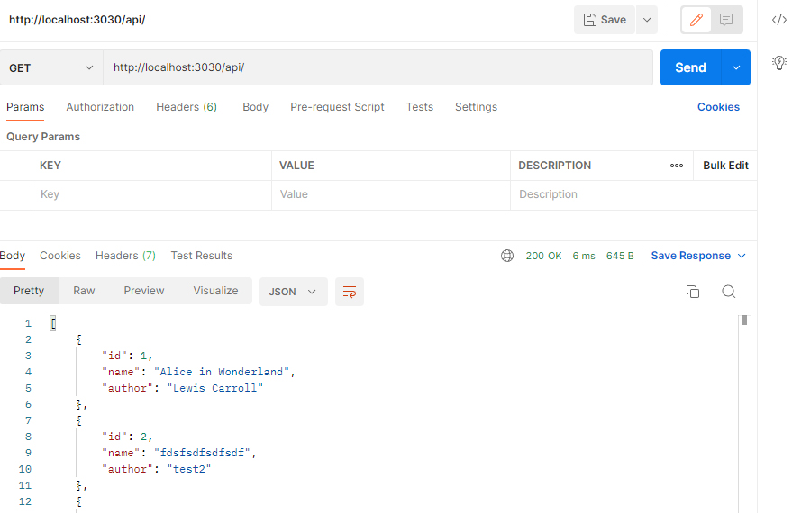
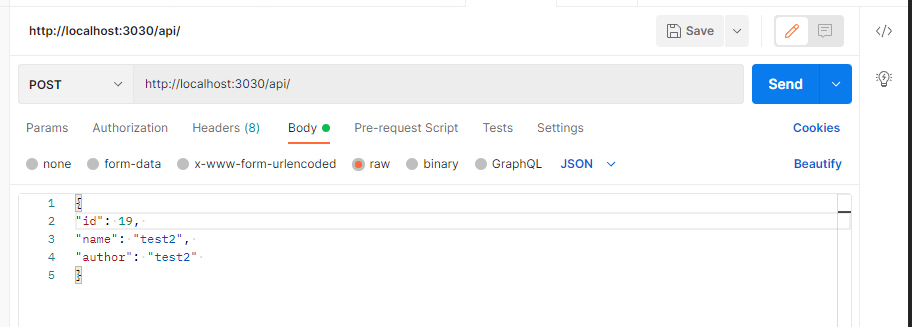
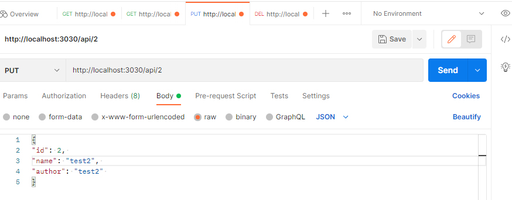
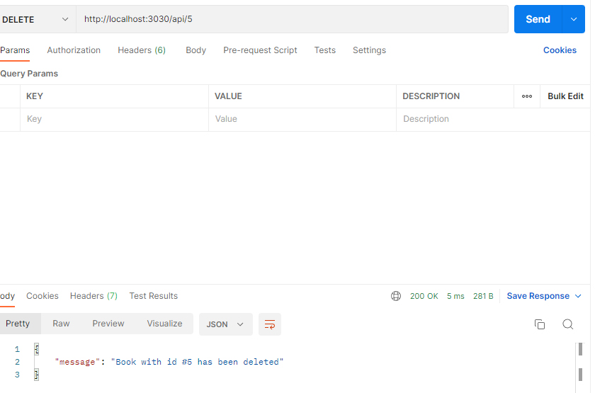

# Node.js Simple book store REST API

## Instructions

1. Clone this repo
2. Run `npm install` 
3. Run `npm start`
4. Go to http://localhost:3030/api/ and make GET, POST, PUT or DELETE requests.

## Examples
No database needed, all data is stored into books.json file. Here are some screenshots of the raw data requests:

List of all available books:

Add new book:

Update book:

Delete book:

